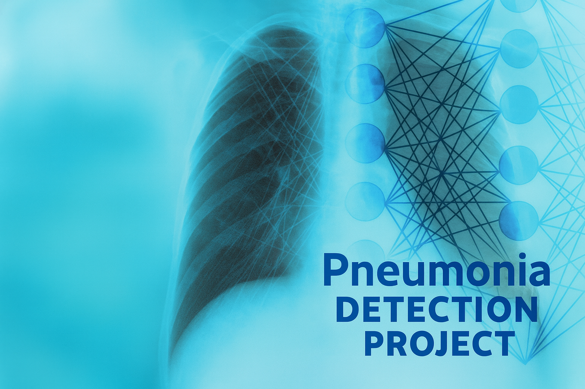

# RSNA PNEUMONIA DETECTION PROJECT



## Описание проекта

Цель проекта — построить модель глубокого обучения, которая классифицирует рентгеновские снимки грудной клетки по трем категориям:  
- **Normal** — без патологии  
- **Lung Opacity** — признаки пневмонии  
- **No Lung Opacity / Not Normal** — другие патологии, не пневмония  

Проект основан на датасете из соревнования [RSNA Pneumonia Detection Challenge (Kaggle, 2018)](https://www.kaggle.com/c/rsna-pneumonia-detection-challenge).  
Используется упрощенная постановка задачи — **классификация** снимков (без детекции bounding boxes).  

---

## Установка зависимостей

Проект выполнялся в виртуальной среде `venv`.

Перед запуском установите необходимые библиотеки:

```bash
    py -m pip install --upgrade pip
    pip install -r requirements.txt
```

## Запуск проекта

- [Скачать данные](https://disk.yandex.ru/d/se8unO6X9aZV0Q) и разместить папки data и models в корне проекта.

### Запустить ноутбуки по порядку:

- 01_eda.ipynb -> исследование данных, конвертация DICOM -> PNG
- 02_baseline_resnet.ipynb -> построение baseline-модели
- 03_transfer_learning.ipynb -> улучшение модели с использование подхода transfer learning и optuna
- 04_training_with_meta.ipynb -> дообучение модели с гиперпараметрами и мета признаками пациента
- 05_final_pipeline.ipynb -> сборка итогового пайплайна для демонстрации

## Структура проекта

```bash
rsna_pneumonia_project/
│
├── data/ # данные (в git не хранятся)
│ ├── raw/ # исходные Kaggle-данные (DICOM + CSV), папка со снимком автора
│ └── processed/ # PNG, train/val/test сплиты
│
├── models/ # сохраненные веса моделей по этапам (*.pth) (в git не хранятся)
│
├── notebooks/ # ноутбуки по шагам
│ ├── 01_eda.ipynb
│ ├── 02_baseline_resnet.ipynb
│ ├── 03_transfer_learning.ipynb
│ ├── 04_training_with_meta.ipynb
│ └── 05_final_pipeline.ipynb
│
├── reports/ # результаты (графики, метрики, финальный пайплайн)
│ ├── figures/ # матрицы ошибок, grad-cam снимки моделей
│
├── src # весь код проекта
│
├── README.md # описание проекта
└── requirements.txt # зависимости
```

## Проект состоит из следующих этапов:

### 1. Анализ структуры и предобработка данных
- знакомство с датасетом (`stage_2_detailed_class_info.csv`)
- исследование распределения классов и дисбаланса
- конвертация изображений из DICOM в PNG/JPEG (train и test выборки)
- визуализация примеров снимков по категориям
- парсинг мета информации из DICOM файлов
- клинический EDA (дополнительные срезы информации)

---

### 2. Построение baseline-модели
- настройка классификатора под три класса
- разделение выборки train / valid
- настройка и использование предобученной ResNet18 (ImageNet)
- балансировка классов
- обучение на train-выборке, валидация на validation-выборке
- инференс модели и расчет **Accuracy** и **F1-score** (валидационная выборка)
- построение confusion matrix
- сохранение отчета метрик модели в csv
- применение **Grad-CAM** для визуализации областей внимания

---

### 3. Улучшение модели (transfer learning)
- настройка классификатора под три класса
- разделение выборки train / valid
- настройка и использование предобученной ResNet50
- балансировка классов
- optuna: поиск гиперпараметров (warm-up stage1->stage2)
- подход с заморозкой слоев и fine-tuning с лучшими гиперпараметрами
- инференс модели и расчет **Accuracy** и **F1-score** (валидационная выборка)
- Построение confusion matrix
- сохранение отчета метрик модели в csv
- применение **Grad-CAM** для визуализации областей внимания
- сравнение результатов с baseline

---

### 4. Дообучение модели учитывая мета информацию
- настройка классификатора под три класса
- разделение выборки train / valid
- модель дообучается на дополнительных данных о пациенте (мета информация)
- балансировка классов
- инференс модели и расчет **Accuracy** и **F1-score** (валидационная выборка)
- сохранение отчета метрик модели в csv
- применение **Grad-CAM** для визуализации областей внимания
- сравнение результатов с transfer

---

### 5. Финальный пайплайн (продакшен)
- короткая демонстрация того, как собирать пайплайн из артефактов проекта
- одиночный инференс по папке с Grad-CAM и JSON-отчетом (один клиент)
- пакетный инференс по папке с агрегированным JSON и опциональными per-file JSON (пакетная обработка)
- заключение

---

## Используемые технологии
- Python 3.12+
- PyTorch, Torchvision
- Pydicom (чтение медицинских снимков)
- Pandas, NumPy
- Scikit-learn (метрики: ROC-AUC, F1-score)  
- Matplotlib, Seaborn
- Grad-CAM для интерпретации
- Optuna
- tqdm
